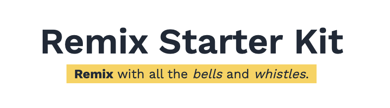
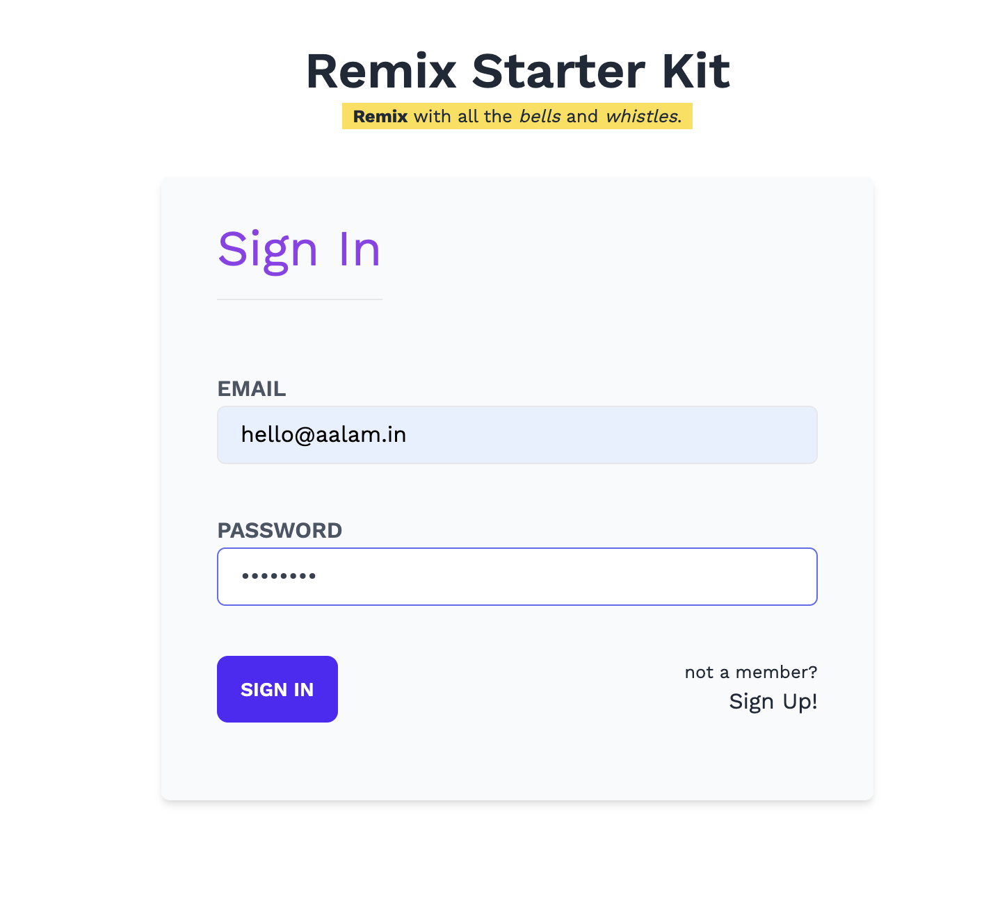
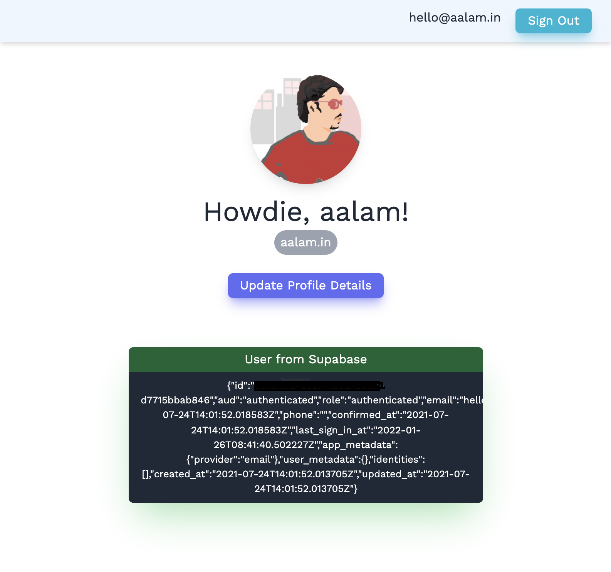
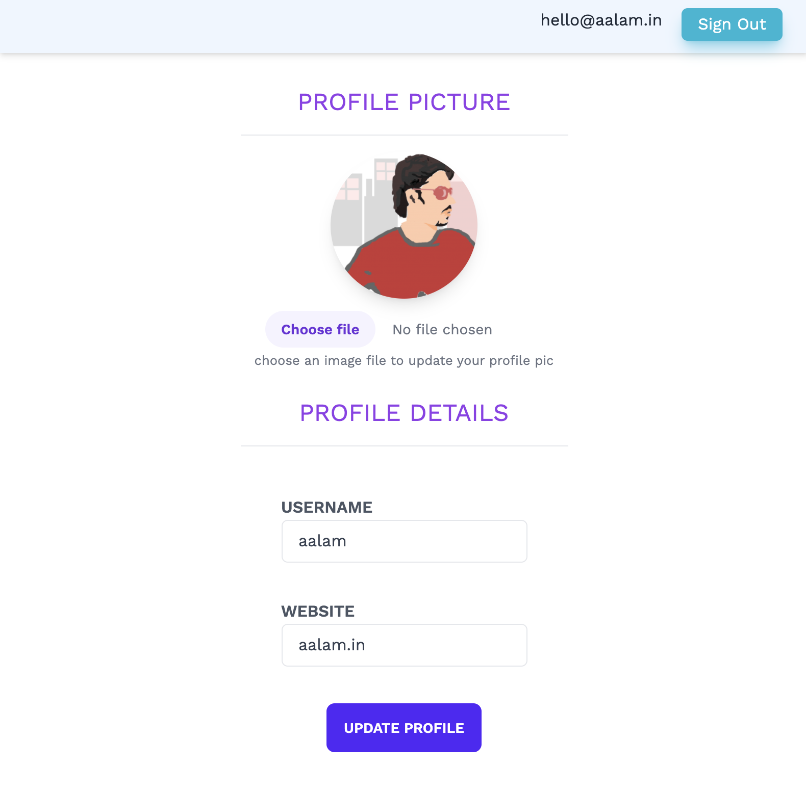

<div align="center">

</div>
<br />

<div align="center"><strong>Remix + Supabase starter for Typescript lovers</strong></div>


_Remix Starter Kit_ is an opinionated boilerplate based off of [Remix](https://remix.run/), with all the bells and whistles you would want ready, up and running when starting a Remix project with Supabase.
<br/>
<div align="center">
  

  

  <a href="https://twitter.com/intent/follow?screen_name=aftabbuddy">
    
  </a>
</div>
<br/>
<!--
<div align="center">
  <sub>Created by <a href="https://twitter.com/aftabbuddy">Aftab Alam</a> with the help of many <a href="https://github.com/one-aalam/remix-starter-kit/graphs/contributors">wonderful contributors</a>.</sub>
</div>
<br />
-->

Out of the box you get all the `essentials`
- __Typescript__ as the language choice
- __Tailwind CSS__ for quick styling without getting out of your HTML
- __Daisy UI__ for pre-made TailwindCSS component classes
- __Headless UI + React Hot Toast__ for robust headless logic you can use for components like Dialog/Modal, Dropdown, List, etc.
- __WorkSans__ as the App font
- __Icons through React-icons__ for on-demand, tree-shakeable icons
- __ESLint__ for static code analysis
- __Prettier__ for code formatting (even for your TailwindCSS classes - sorted as per Tailwindlab reccomendations)
- __Playwright__ for reliable end-to-end test cases (+ end-to-end test cases for the homepage and the sign-in page)

with [Supabase](https://supabase.io/) support
- __Authentication System__ with Supabase GoTrue
- __User Profiles__ available on `/profile` as an example for Supabase PostgREST (CRUD API) (*retreival-only for now*)
- __User Avatar__ with Supbase Storage(AWS S3 backed effortless uploads) available on `/images/[bucket-name]/[image-name]` resource routes. When retrieving you use the SDK server-side, and when uploading you use the client-side SDK loaded from CDN to upload the images to Supabase managed buckets, which are linked to profile on successful uploads.

and a bunch of pre-made, hand-rolled(easily replace-able) components, that you almost always end up installing/using for any non-trivial project

- __*Bonus(Ad)__ wanna experiment with Edge/Cloudflare? Check out [Remix Edge Kit](https://github.com/one-aalam/remix-edge-kit/) and choose your journey with [FaunaDB](https://github.com/one-aalam/remix-edge-kit/tree/with-fauna), [Supabase](https://github.com/one-aalam/remix-edge-kit/tree/with-supabase), or [Prisma + DataProxy](https://github.com/one-aalam/remix-edge-kit/tree/main)(Railway.app) or [Prisma + DataProxy](https://github.com/one-aalam/remix-edge-kit/tree/with-planetscale)(Planetscale). The later 2 are WIP.

__Note__: Refer the [basic](https://github.com/one-aalam/remix-starter-kit/tree/basic) branch for a bare minimum starter structure with all the `essentials`.


## Quick Start

The best way to start with this template is to click "Use this template" above, create your own copy and work with it

### Development

To start the project locally, run:
```bash
npm run dev
```
which kickstarts the Remix development and build server as well as TailwindCSS compilation in the watch mode. Open `http://localhost:3000` in your browser to start working.

Check `package.json` for the full list of commands available at your disposal.

## How to Setup Supabase for Remix Starter Kit?
If new to Supabase
- Create account at [Supabase](https://app.supabase.io/)
- Create a Organisation, and a project

Once done, or if you already have a Supabase project
- Copy the generated project's API authentication details from `https://app.supabase.io/project/<your-awesome-remix-project>/api/default?page=auth`
- Place the details in `.env` as `SUPABASE_URL` and `SUPABASE_KEY`
- Install NPM dependencies, by running `npm install` or `npm i`

Remix Starter Kit supports user profiles and user avatars. To get the profile table and storage ready, execute the following queries at `https://app.supabase.io/project/<your-awesome-remix-project>/editor/sql`

```sql
-- Create a table for Public Profiles
create table profiles (
  id uuid references auth.users not null,
  username text unique,
  avatar_url text,
  website text,
  updated_at timestamp with time zone,

  primary key (id),
  unique(username),
  constraint username_length check (char_length(username) >= 3)
);

alter table profiles enable row level security;

create policy "Public profiles are viewable by everyone."
  on profiles for select
  using ( true );

create policy "Users can insert their own profile."
  on profiles for insert
  with check ( auth.uid() = id );

create policy "Users can update own profile."
  on profiles for update
  using ( auth.uid() = id );

-- Set up Storage!
insert into storage.buckets (id, name)
values ('avatars', 'avatars');

create policy "Avatar images are publicly accessible."
  on storage.objects for select
  using ( bucket_id = 'avatars' );

create policy "Anyone can upload an avatar."
  on storage.objects for insert
  with check ( bucket_id = 'avatars' );
```
**Note** When going live remember to configure `SUPABASE_URL` and `SUPABASE_KEY` in your deployment service provider like Vercel

## What you'll get?
With all the configs done right, you should get the following screens/views up and running


### Sign In
<hr/>

<hr/>

### Sign In (with validation errors)
<hr/>

<hr/>

### Sign Up
<hr/>

<hr/>

### Profile (default landing)
<hr/>

<hr/>

### Profile Update Screen (with image upload)
<hr/>



## Recommendations
- Use `npm-check-updates` to ineractively update your dependencies using `ncu -i`

## License
MIT
